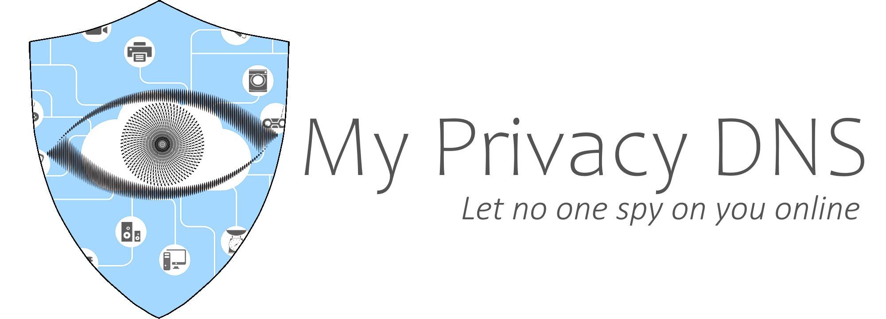

# TrackIt

TrackIt is the latest variant in torrent tracker list, which is to be a handcrafted project equally to
[My Privacy DNS][MpDNS]'s [Matrix][Matrix] project.

## History

This project came to live thanks to [qBittorrent Enhanced Edition][qEE]

The reason qEE tricked me to build setup this project is the fact of a rather nifty feature, that isn't represented in
the standard version of qB. Autoupdate the tracker list from a public list.

The problem with the default list is many, along the list of issues is (of time of writing this):

1. The list is not public available and comes with treads of your privacy as it is hosted on `jsdelivr.net` which is financed by collection data of your privacy data.
2. 7/20 listed trackers are hidden, censored and controlled directly by CloudFlare in it's walled garden, for extracting as much data about _YOU_ as ever possible, This is done by operating the MITM network of reverse decrypting proxies.
3. 3 of these domains are no longer active nor registered to anyone

This alone means 50% of the list is down and no longer available nor usable as public trackers.

## Objective

By building this alternative list and only using a handcrafted list, we can perform better, by

1. Not building to big and dump list, which only is used for the initial of new torrents, then the `DHT`, `PeX` and `LSD` is to locate seeders (Source for data fetching)
2. Better ensure to keep privacy respecting sources

## Sponsors

- Jetbrains, Provided free licence to any members, who have been working more than 3 month for My Privacy DNS open
  source project https://www.jetbrains.com/community/opensource/.

[//]: # (Link index, sort by appearance)

[MpDNS]: https://www.mypdns.org/ "My Privacy DNS, Let no one track you online"

[Matrix]: https://github.com/mypdns/matrix "My Privacy DNS handcrafted blacklists"

[qEE]: https://github.com/c0re100/qBittorrent-Enhanced-Edition "qBittorrent Enhanced Edition"
